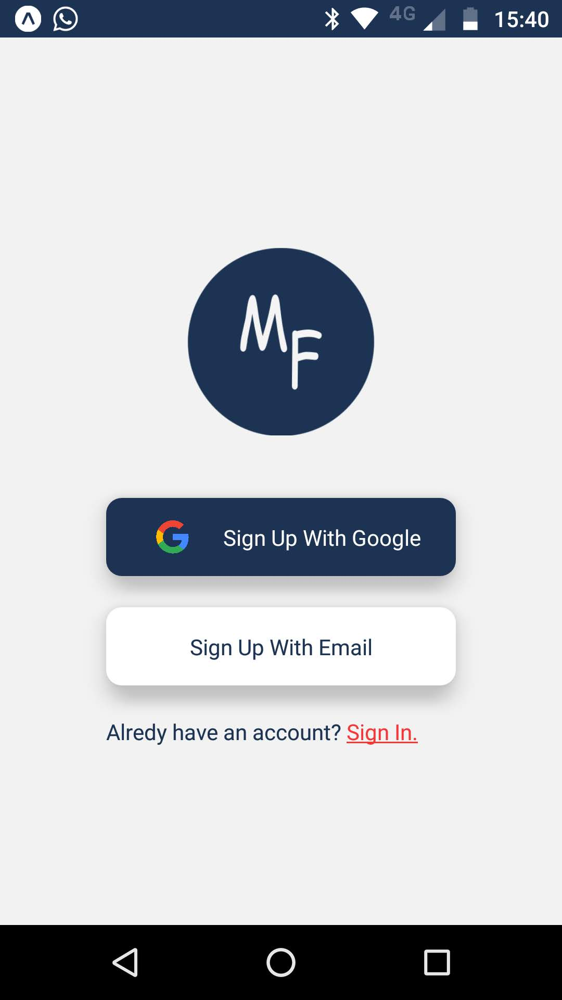
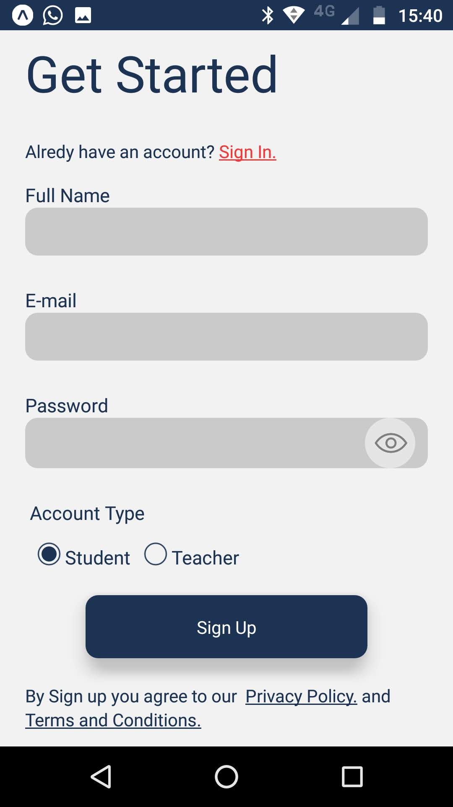
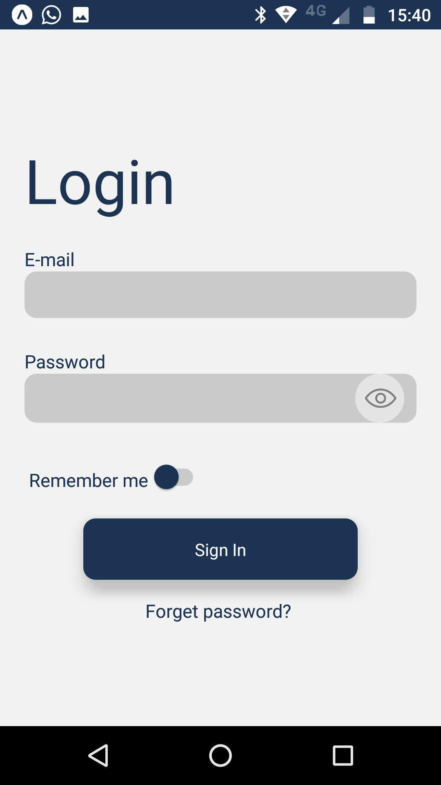

<h2>My Friends - style exercise</h2>

 

<ul>
<li>React Native</li>
</ul>

 

 Project developed during Senai's DEVinHouse course on 2022 as an exercise of creating screen styles.

 

    

 

    

 

    

